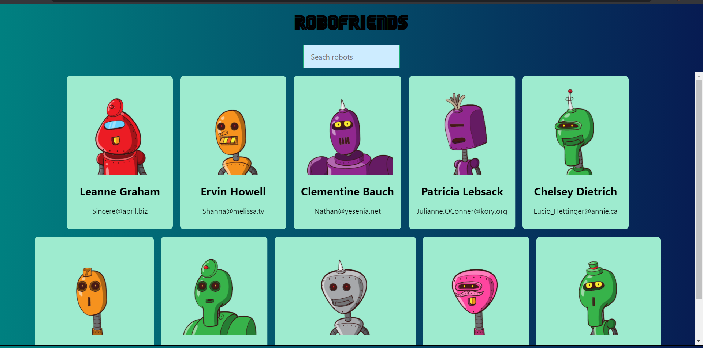

### Hey there 👋 I'm Hrishi 

- 🔭 I’m currently working on Android Development.
- 🌱 I’m currently learning ML and AI.
- 👯 I’m looking to collaborate on cool ML projects or any sorts.
- 🤔 I’m looking for help with DevOps.
- 💬 Ask me about Web Development 
- ⚡ Fun fact: Nobody's gonna read this , if u did 
<h3 align="left">Let's have some chitchat</h3>

  
-📫my email: hrishikumbhar156@gmail.com

<h3 align="left">Languages and Tools:</h3>

       <a href="https://kotlinlang.org" target="_blank">     

  <h4>Here are my smol react projects: </h4>
  

  
  

